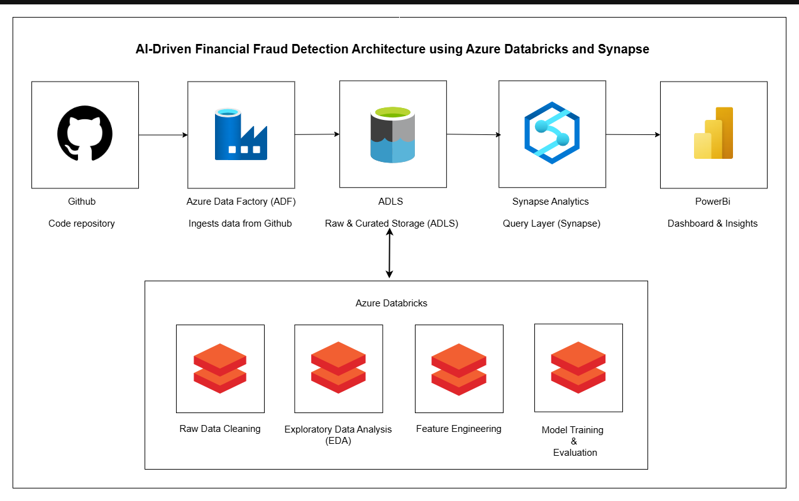

# 🚨 AI-Driven Financial Fraud Detection using Azure Databricks & Synapse

## 🧠 Overview

Financial fraud detection is a critical challenge in the banking and fintech sectors. This project builds a **scalable**, **modular**, and **production-grade** data engineering pipeline to detect anomalies and flag potential fraudulent transactions using **Azure-native services**.

It includes real-world data ingestion, processing, machine learning, and visualization — enabling **real-time insights and fraud mitigation**.

---

## ❗ Problem Statement

Manual fraud detection is:

* Time-consuming
* Error-prone
* Not scalable

### ⚡ Objectives:

* Detect fraudulent transactions from high-volume transactional data
* Apply scalable ML techniques for anomaly detection
* Design a star schema for efficient querying
* Deliver insights through a Power BI dashboard

---

## ✅ Solution Architecture

---

## 🧰 Tech Stack

| Layer             | Tools/Services Used                 |
| ----------------- | ----------------------------------- |
| **Ingestion**     | Azure Data Factory (ADF)            |
| **Storage**       | Azure Data Lake Storage Gen2 (ADLS) |
| **Processing**    | Azure Databricks (PySpark)          |
| **ML Training**   | XGBoost, MLflow                     |
| **Warehouse**     | Azure Synapse Analytics             |
| **Visualization** | Power BI                            |
| **Languages**     | Python, SQL                         |

---

## 🔄 Data Pipeline Flow

## 📂 Data Source

The dataset used in this project is originally sourced from Kaggle and has been uploaded to a public GitHub repository for pipeline ingestion.

🔗 [Fraud Detection Dataset on Kaggle](https://www.kaggle.com/datasets/goyaladi/fraud-detection-dataset/data)

### 1. **Data Ingestion**

* **Source**: Public GitHub repository (CSV files)
* **Tool**: Azure Data Factory
* **Destination**: ADLS Raw Zone

### 2. **Data Cleaning & Exploratory Data Analysis (EDA)**

* **Tool**: Azure Databricks (PySpark)
* **Processes**:

  * Null and missing value handling
  * Schema validation
  * Univariate and bivariate analysis

### 3. **Feature Engineering**

* Derived fields:

  * `IsHighAmount`
  * `HourOfTransaction`
  * `RecentLoginGapDays`
* Anomaly score generation using Isolation Forest
* Enrichment: customer & merchant profiles

### 4. **Model Training & Evaluation**

* **Model**: XGBoost Classifier
* **Tool**: MLflow on Databricks
* **Steps**:

  * Train-test split
  * Autologging for metrics tracking
  * Model versioning and artifact storage

### 5. **Data Modeling (Star Schema)**

* **Fact Table**: `fact_transactions`
* **Dimension Tables**:

  * `dim_customer`
  * `dim_merchant`
  * `dim_time`
* **Format**: Parquet
* **Storage**: ADLS Curated Zone

### 6. **Data Serving**

* **Tool**: Azure Synapse Analytics
* Created external tables over curated data
* Wrote analytical SQL queries for BI insights

### 7. **Visualization**

* **Tool**: Power BI
* Connected to Synapse views
* Dashboard visuals:

  * Fraudulent vs Non-Fraudulent Transactions
  * High-Risk Merchants
  * Fraud Trends by Time & Region

---

## 🧪 Key Results

* ✅ **Detection Accuracy**: >70%
* 📊 **Interactive Dashboard**: 6+ key visuals
* ♻️ **Reusable Pipeline**: Handles future data batches
* 🏗️ **Cloud-Native Design**: Entirely on Azure

---

## 🖼️ Screenshots & Links

1. Azure Data Factory pipeline
   

2. Azure Data Lake Storage 
   

3. Databricks Notebooks (Cleaning & Modeling):
   🔗 [View Notebooks in Repository](./notebooks/fd_cleaning.ipynb)
   
     
   🔗 [View Notebooks in Repository](./notebooks/EDA_notebook.ipynb)
   
     
   🔗 [View Notebooks in Repository](./notebooks/feature_engineering.ipynb)
   
     

4. MLflow Experiment Tracking:
   🔗 [View Notebooks in Repository](./notebooks/Model%20Training_notebook.ipynb)
   

5. Synapse SQL Output:
   🔗 [View script in Repository](./synapse/script.sql)
   

6. Power BI Dashboard:
   

---
## 📌 Key Learnings

* ✅ Working with imbalanced datasets using class weighting
* 📉 Real-time fraud detection using unsupervised and supervised ML
* 📦 CI-friendly modular design using Azure-native tools
* 📈 Power BI integration with Synapse for real-time insights

---

## 🧭 Future Scope

* ⏱️ Real-time streaming using Azure Event Hubs + Structured Streaming
* 🛗️ Alerts and notifications for high-risk transactions
* 🔀 CI/CD for notebook deployment and data workflows (using GitHub Actions)

---
